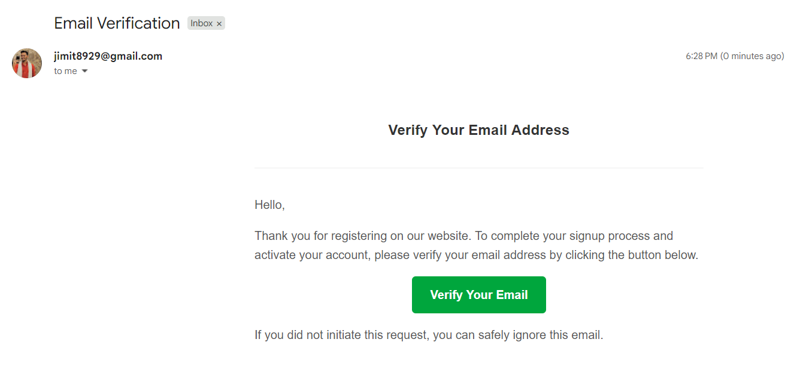
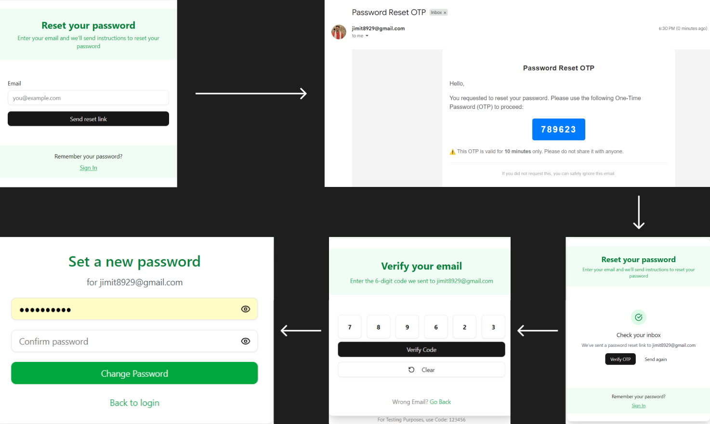

# 🔐 Advanced Authentication System

A comprehensive full-stack authentication system built with the MERN stack, featuring <strong>Email Verification with OTP, Password Reset Functionality,</strong> and <strong>Google OAuth Integration.</strong> This project demonstrates modern authentication practices and security implementations.

## ✨ Features

### 🔑 Core Authentication
- **User Registration & Login** - Secure user account creation and authentication
- **Email Verification with OTP** - One-time password verification for enhanced security
- **Password Reset** - Secure password recovery via email
- **Google OAuth Integration** - Login with Google using Passport.js

### 🛡️ Security Features
- **Password Hashing** - Secure password storage using bcryptjs
- **JWT Token Management** - Secure session handling
- **Protected Routes** - Route-level authentication middleware
- **Input Validation** - Server-side validation for security

## 📸 Project Overview

### Email Verification



### Reset Password and Change Password Flow



## 🚀 Tech Stack

### Frontend
- **React.js** - Modern JavaScript library for building user interfaces
- **Tailwind CSS** - Utility-first CSS framework for styling
- **React Router DOM** - Declarative routing for React applications

### Backend
- **Node.js** - JavaScript runtime environment
- **Express.js** - Fast, unopinionated web framework
- **MongoDB** - NoSQL database for user data storage
- **bcryptjs** - Password hashing library

### Authentication & Email
- **Passport.js** - Authentication middleware for Node.js
- **Nodemailer** - Email sending functionality
- **Google OAuth 2.0** - Social authentication integration

### Development Tools
- **Postman** - API testing and development


## 🛠️ Installation & Setup

### Prerequisites
- Node.js (v14 or higher)
- MongoDB
- Gmail account (for Nodemailer)
- Google Developer Console account (for OAuth)

### 1. Clone the Repository
```bash
git clone https://github.com/jimit8929/Advance_Authentication.git
cd Advance_Authentication
```

### 2. Backend Setup
```bash
cd backend
npm install
```

Create a `.env` file in the backend directory:
```env
PORT=5000
MONGODB_URI=your_mongodb_connection_string
JWT_SECRET=your_jwt_secret
EMAIL_USER=your_gmail_address
EMAIL_PASS=your_gmail_app_password
GOOGLE_CLIENT_ID=your_google_client_id
GOOGLE_CLIENT_SECRET=your_google_client_secret
FRONTEND_URL=http://localhost:3000
```

### 3. Frontend Setup
```bash
cd frontend
npm install
```

### 4. Run the Application
```bash
# Start backend server
cd backend
npm start

# Start frontend development server (in a new terminal)
cd frontend
npm start
```

## 🔧 Configuration

### Email Configuration (Nodemailer)
1. Enable 2-factor authentication on your Gmail account
2. Generate an App Password for Gmail
3. Add your email credentials to the `.env` file

### Google OAuth Setup
1. Go to [Google Developer Console](https://console.developers.google.com/)
2. Create a new project or select existing one
3. Enable Google+ API
4. Create OAuth 2.0 credentials
5. Add authorized redirect URIs
6. Add client ID and secret to `.env` file

### MongoDB Setup
1. Create a MongoDB database (local or MongoDB Atlas)
2. Add the connection string to `.env` file


## 🔄 Authentication Flow

### Email Verification
1. User registers with email and password
2. System sends OTP to user's email via Nodemailer
3. User enters OTP to verify email address
4. Account is activated upon successful verification

### Password Reset
1. User requests password reset with email
2. System generates secure reset token
3. Reset link sent to user's email
4. User clicks link and sets new password

### Google OAuth
1. User clicks "Login with Google"
2. Redirected to Google authentication
3. Google returns user data to callback URL
4. System creates/updates user account
5. User is logged in with JWT token


## 🎯 Learning Outcomes

This project helped me understand and implement:

- **Email Integration**: Using Nodemailer for sending verification and reset emails
- **OAuth Implementation**: Integrating third-party authentication with Passport.js
- **Security Best Practices**: Password hashing, token management, and secure data handling
- **Full-Stack Development**: Connecting React frontend with Express backend
- **Database Operations**: User management with MongoDB
- **API Development**: RESTful API design and implementation


## 🔍 Testing

Use Postman to test API endpoints:
1. Import the API collection
2. Test registration and email verification
3. Verify login functionality
4. Test password reset flow
5. Check Google OAuth integration


## 📧 Contact

**Jimit** - [GitHub Profile](https://github.com/jimit8929)

---


⭐ **Star this repository if you found it helpful!**